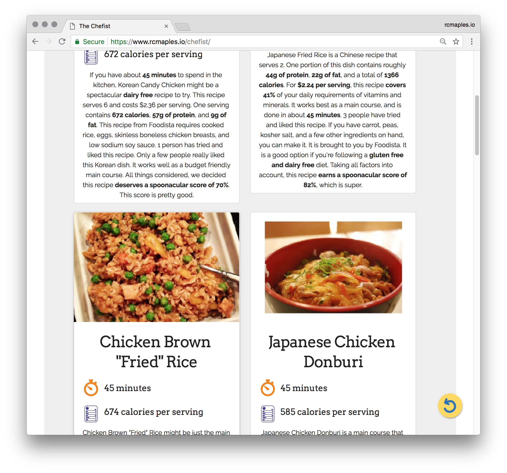

# The Chefist

- [View it Live](https://rcmaples.io/chefist)

## What/Why/How
Chefist takes a list of ingredients from the user and locates recipes that can be made with those ingredients. Results are set to prioritize open license recipes minimizing non-included ingredients using endpoint parameters.

The form dynamically increases as the user nears the bottom. There are a max of 10 items allowed in the search. This is largely arbitrary and can be modified as needed.

Upon submitting the form, the app calls the first API endpoint to return a list of recipes. Once the list is generated, the app iterates through the list to calls a second API endpoint on each item to populate Calories and Cook Time in the summary cards.

The user can either return to the search form or select a recipe. Upon selecting a recipe, the app takes the data from the previous calls and presents it. At this point the user can read the recipe, check for wine suggestions, or go back to the search results.

## Screenshots
Login Screen/Landing Page:

Search Results:

Recipe Card:

## Built With

### Front-End
* jQuery
* jQuery Modal
* Normalize
* Modernizr.js

#### Features

* Input a list of Ingredients
* Get a list of Recipe's you can make
* See wine recommendations for recipe of your choice